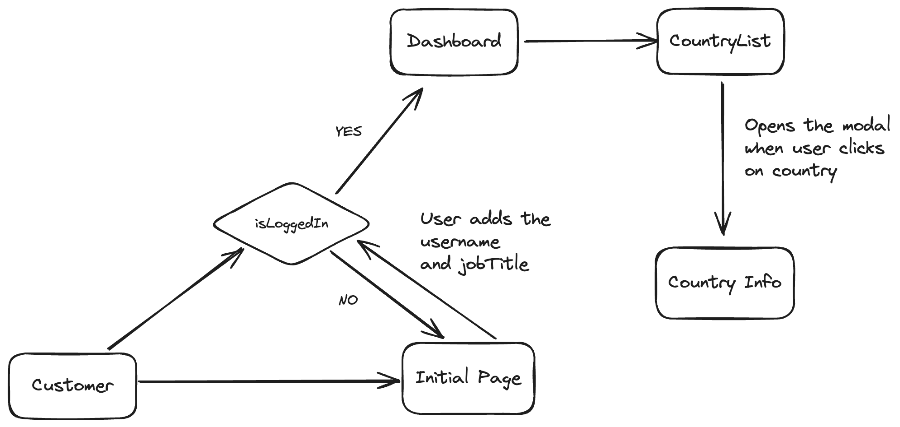

# Build a NextJS application with GraphQL and Typescript

## Technologies

- NextJS
- TypeScript
- ChakraUI
- GraphQL
- Apollo
- Zod

## Requirements

Have a welcome modal with two separate slides:

- On the first modal slide, have the user set a username.
- On the second modal slide, have the user set their job title.
- Save the user’s username and job title information in the way you best see fit.
- You should be able to view this information somewhere once you log in, and be able to change it.
- The user’s information should also be persisted
  Use Apollo client to query a public GraphQL API.
- Display the GraphQL API data as items on an “Information Page” that is mobile and tablet compatible.
- Users should not be able to view the “Information Page” until the user has set their information.
- Have it so when you click a listed item on the “Information Page”, it should open a modal that displays the information about that item.
- Deploy on Vercel free tier.

## How to run the run the project?

First, run the development server:

```bash
npm run dev
# or
yarn dev
# or
pnpm dev
# or
bun dev
```

Open [http://localhost:3000](http://localhost:3000) with your browser to see the result.

## What next?

- Add e2e tests using cypress or playwright.
- Integrate Sentry for monitoring errors.
- Create a Docker image for testing or deployment.
- Observability with Prometheus and Grafana.

## Concepts

- GraphQL & Apollo
- Cache Management in Apollo Client
- NextJS
- Typescript
- React hooks
- Zod validations
- Unit testing with vitest and testing-library/react

## User flow



# Deployment

## What will we use

- Vercel
